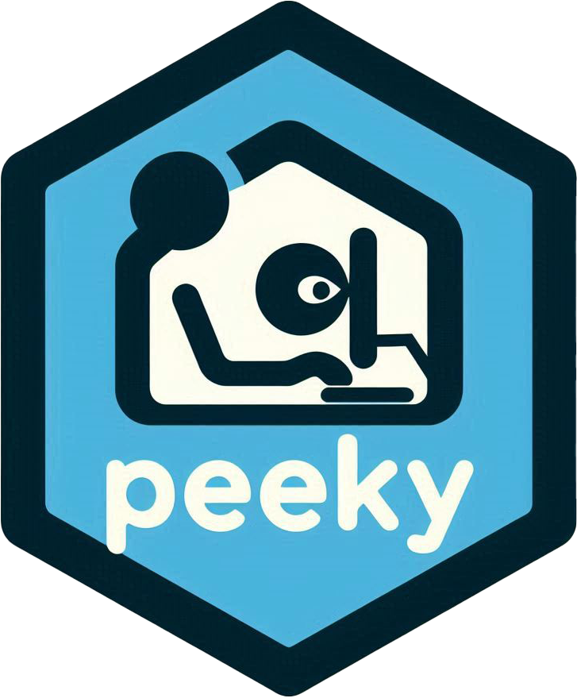

<!-- README.md is generated from README.Rmd. Please edit that file -->

# peeky 

<!-- badges: start -->

[](https://github.com/coatless-rpkg/peeky/actions/workflows/R-CMD-check.yaml)
<!-- badges: end -->

The `peeky` package helps you extract, examine, and run the source code
from Shiny applications that have been converted to run in the browser
using [Shinylive](https://shiny.posit.co/py/docs/shinylive.html). It
works with both standalone applications and [Quarto](https://quarto.org)
documents containing Shinylive components through the
[quarto-shinylive](https://github.com/quarto-ext/shinylive) extension,
supporting both R and Python Shiny applications.

## About Shinylive

[Shinylive](https://shiny.posit.co/py/docs/shinylive.html) converts
existing Shiny applications to run entirely in the web browser using
[WebAssembly](https://webassembly.org/) versions of R
([webR](https://docs.r-wasm.org/webr/latest/)) and Python
([Pyodide](https://pyodide.org/en/stable/)), eliminating the need for a
computational server. This means all application files are accessible to
users by design as they are downloaded to the user’s browser when the
application is loaded.

The Shinylive ecosystem consists of four main components:

- Shinylive Web Assets:
  [posit-dev/shinylive](https://github.com/posit-dev/shinylive)
- R Shiny App Converter Package:
  [posit-dev/r-shinylive](https://github.com/posit-dev/r-shinylive)
- Python Shiny App Convert Package:
  [posit-dev/py-shinylive](https://github.com/posit-dev/py-shinylive)
- Shinylive Quarto Extension:
  [quarto-ext/shinylive](https://github.com/quarto-ext/shinylive)

## There Are No Secrets in Shinylive

The `peeky` package was developed to demonstrate a fundamental truth
about Shinylive applications stressed by its developers: **“There are no
secrets.”**

Unlike traditional Shiny applications where server-side code remains
private, Shinylive apps run entirely in the web browser, making **all**
associated files accessible to users. This includes the source code,
data, and any other files used by the application. As a result,
Shinylive applications are transparent by design.

This package was developed as part of ongoing discussions in STATS 290
about Shiny application security, transparency, and deployment options.
It serves as a practical demonstration of the differences between
traditional server-side applications and modern browser-based
alternatives.

## Installation

You can install the development version of peeky from
[GitHub](https://github.com/) with:

``` r
# install.packages("remotes")
remotes::install_github("coatless-rpkg/peeky")
```

## Usage

To use the package, load it into your R session:

``` r
library(peeky)
```

Inside the package, there are three main functions:

| Function | Description |
|----|----|
| `peek_shinylive_app()` | Universal function that handles both standalone apps and Quarto docs |
| `peek_standalone_shinylive_app()` | Specifically for standalone Shinylive applications |
| `peek_quarto_shinylive_app()` | Specifically for Quarto documents with Shinylive components |

### Extracting Shinylive Applications

We suggest using the `peek_shinylive_app()` function as it can handle
both standalone Shinylive applications and Quarto documents with
Shinylive components. For instance, if we take the main Shinylive
extension website, we get:

``` r
peeky::peek_shinylive_app("https://quarto-ext.github.io/shinylive/")
#> 
#> ── Shinylive Applications ──────────────────────────────────────────────────────
#> 
#> ── Shiny for Python Applications ──
#> 
#> Run in Terminal:
#> shiny run --reload --launch-browser "/Users/ronin/Documents/GitHub/r-pkg/peeky/converted_shiny_app/app_1/app.py"
#> shiny run --reload --launch-browser "/Users/ronin/Documents/GitHub/r-pkg/peeky/converted_shiny_app/app_2/app.py"
#> shiny run --reload --launch-browser "/Users/ronin/Documents/GitHub/r-pkg/peeky/converted_shiny_app/app_3/app.py"
#> shiny run --reload --launch-browser "/Users/ronin/Documents/GitHub/r-pkg/peeky/converted_shiny_app/app_4/app.py"
```

This would be equivalent to if we ran the following:

``` r
peeky::peek_quarto_shinylive_app("https://quarto-ext.github.io/shinylive/")
```

By default, the extracted files will be placed in the current working
directory under the `converted_shiny_apps` directory. Each application
will be placed in a subdirectory named `app_1`, `app_2`, etc. If we want
to specify a different output directory, we can do so by providing the
`output_path` argument. We can also specify the output format as
`quarto` to extract the files into a single Quarto document.

``` r
# Extract the Shinylive application into a different directory
peeky::peek_quarto_shinylive_app("https://quarto-ext.github.io/shinylive/", output_format = "quarto")
#> 
#> ── Quarto Document with Shinylive Applications ─────────────────────────────────
#> 
#> ── Setup and Preview Steps ──
#> 
#> Step 1: Install the Shinylive extension:
#> quarto add quarto-ext/shinylive
#> 
#> Step 2: Preview the document:
#> quarto preview "converted_shiny_apps.qmd"
#> 
#> ── Contents ──
#> 
#> • R applications: 0
#> • Python applications: 4
```

We can switch to the `peek_standalone_shinylive_app()` function if we
know that the URL is a standalone Shinylive application. For example, if
we take the example application used in the conversion tutorial from [an
app.R to an R Shinylive
app](https://github.com/coatless-tutorials/convert-shiny-app-r-shinylive)
on GitHub, we get:

``` r
peeky::peek_standalone_shinylive_app("https://tutorials.thecoatlessprofessor.com/convert-shiny-app-r-shinylive/")
#> 
#> ── Standalone Shinylive Application ────────────────────────────────────────────
#> Type: R Shiny
#> Run in R:
#> shiny::runApp("/Users/ronin/Documents/GitHub/r-pkg/peeky/converted_shiny_app")
#> 
#> ── Contents ──
#> 
#> .md files:
#> • README.md
#> .R files:
#> • app.R
#> 
#> Total files: 2
#> 
#> Location: '/Users/ronin/Documents/GitHub/r-pkg/peeky/converted_shiny_app'
```

## License

AGPL (\>= 3)

## Evolution

This package represents a more refined and comprehensive approach
compared to our [earlier
tutorial](https://github.com/coatless-tutorials/peeking-at-an-r-shinylive-app-source-code)
that focused solely on standalone R Shinylive applications.

## Ethical Considerations

This package is for educational purposes. Users should:

- Use responsibly
- Respect intellectual property rights
- Understand that viewable code doesn’t imply permission to reuse
- Consider this when designing their own applications

## Acknowledgements

Thanks to the Shinylive team and the
[webR](https://docs.r-wasm.org/webr/latest/) and
[Pyodide](https://pyodide.org/en/stable/) teams for enabling
browser-based data science.
